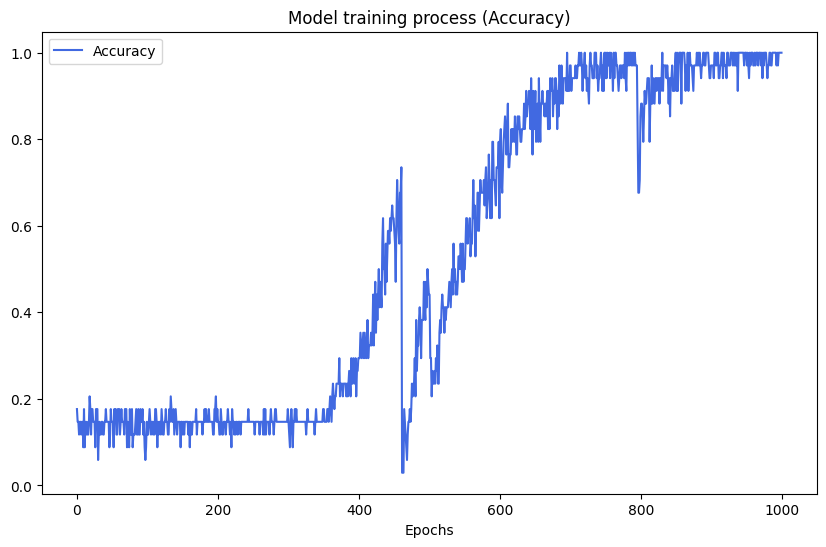

# Lyrics Generator (Thai Somg)<br>
   ## Requirement<br>
     matplotlib==3.9.2
     seaborn==0.13.2
     scikit-learn==1.6.0
     tensorboard==2.10.1
     tensorboard-data-server==0.6.1
     tensorboard-plugin-wit==1.8.1
     tensorflow==2.10.0
     tensorflow-estimator==2.10.0
     tensorflow-io-gcs-filesystem==0.31.0
     tensorflow-intel==2.13.0
     keras==2.10.0
     Keras-Preprocessing==1.1.2
     
      Or
       
    $ pip install -r requirements.txt

## Import package file
   import lib and check version Tensorflow.
   ```python 
   import pandas as pd
   import numpy as np
   import matplotlib.pyplot as plt
   
   from pythainlp import word_tokenize
   
   import tensorflow as tf
   from tensorflow.keras.preprocessing.text import Tokenizer
   from tensorflow.keras.preprocessing.sequence import pad_sequences
   from tensorflow.keras.utils import to_categorical
   from tensorflow.keras.optimizers import Adam
   from tensorflow.keras.models import Sequential
   from tensorflow.keras.layers import LSTM, Embedding, Dense, Dropout
   
   print(f'Tensorflow version: {tf.__version__}')
   ```

## Open Dataset with pandas
   ```python 
   df = pd.read_csv('Dataset/data_lyrics_for_train.csv')
   ```
## Data Preprocessing
   create column Lyrics_token
   ```python 
   df['Lyrics_token'] = df['Lyrics'].apply(lambda text: word_tokenize(text,engine = 'newmm',keep_whitespace = False))
   df['Lyrics_token'] = df['Lyrics_token'].apply(lambda text: ' '.join(text))
   df['Lyrics_token'] = df['Lyrics_token'].replace("\n","")
   ```
  word Tokenize
   ```python 
   tokenizer = Tokenizer() 
   tokenizer.fit_on_texts(df['Lyrics_token'])
   totalWords = len(tokenizer.word_index) + 1 
   print(f'Total unique word: {totalWords}')
   ```
   sequences Tokens
   ```python 
   sequencesTokens = []
   
   for token in df['Lyrics_token']:
       listToken = tokenizer.texts_to_sequences([token])[0]
       for i in range(1, len(listToken)):
         sequenceToken = listToken[:i + 1]
       sequencesTokens.append(sequenceToken)

   maxLength = max([len(x) for x in sequencesTokens])
   sequencesTokens = pad_sequences(sequencesTokens,maxlen = maxLength,padding = 'pre')
   
   features = sequencesTokens[:, :-1]
   labels = sequencesTokens[:, -1] 
   ```
## One-hot Encoding
   ```python
   labels = to_categorical(labels,num_classes = totalWords)
   ```

## Create Model
      _________________________________________________________________
       Layer (type)                Output Shape              Param #   
      =================================================================
       embedding (Embedding)       (None, 370, 128)          114304    
                                                                       
       lstm (LSTM)                 (None, 370, 256)          394240    
                                                                       
       dropout (Dropout)           (None, 370, 256)          0         
                                                                       
       lstm_1 (LSTM)               (None, 370, 256)          525312    
                                                                       
       dropout_1 (Dropout)         (None, 370, 256)          0         
                                                                       
       lstm_2 (LSTM)               (None, 128)               197120    
                                                                       
       dropout_2 (Dropout)         (None, 128)               0         
                                                                       
       dense (Dense)               (None, 893)               115197    
                                                                       
      =================================================================
      Total params: 1,346,173
      Trainable params: 1,346,173
      Non-trainable params: 0

## Train Model
   ```python
   EPOCHS = 1000
   RATE = 0.001
   
   opt = Adam(learning_rate = RATE)
   
   model.compile(optimizer = opt,loss = 'categorical_crossentropy',metrics = ['accuracy'])
   
   history = model.fit(features,labels,epochs = EPOCHS, batch_size=50)
   ```

## Result
   


